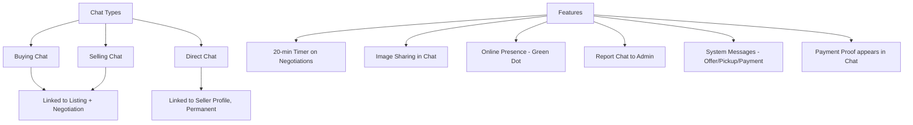

# REDLINE Chat System — Complete Rebuild

Rebuild the entire negotiation/chat system from scratch with **3 chat types**, online presence, image sharing, report system, and a 20-minute negotiation timer — inspired by the WhatsApp-style reference UI.

## User Review Required

> [!IMPORTANT]
> **This is a major rebuild.** All existing `negotiations` and `negotiation_messages` data will be preserved via migration — old tables are renamed, not dropped. But the entire chat UX changes fundamentally.

> [!WARNING]
> **New DB tables required.** A migration script (`migrate_chat_v2.php`) must be run once before the new system works. The old `negotiate.php` is fully replaced.

> [!CAUTION]
> **Online presence** uses a `last_seen` heartbeat column on `users`. This means we add a new column to the existing `users` table. This is safe, but the heartbeat pings every 30s per logged-in user.

---

## Architecture Overview



---

## Proposed Changes

### Database Layer

#### [NEW] `migrate_chat_v2.php`

Creates the new unified chat schema:

**`conversations` table** — replaces `negotiations`:
| Column | Type | Description |
|--------|------|-------------|
| `id` | INT PK | |
| `type` | ENUM('buying','selling','direct') | Chat type |
| `listing_id` | INT NULL | Only for buying/selling chats |
| `buyer_id` | INT | Initiator for buying, receiver for selling |
| `seller_id` | INT | |
| `status` | ENUM('active','accepted','rejected','expired','completed') | |
| `offered_price` | DECIMAL | Latest offer amount |
| `expires_at` | DATETIME NULL | 20-min expiry window for buying/selling |
| `created_at` | TIMESTAMP | |
| `updated_at` | TIMESTAMP | |

**`chat_messages` table** — replaces `negotiation_messages`:
| Column | Type | Description |
|--------|------|-------------|
| `id` | INT PK | |
| `conversation_id` | INT FK | |
| `sender_id` | INT FK | |
| `message` | TEXT NULL | Text content |
| `msg_type` | ENUM('text','image','offer','counter','accept','reject','system','payment_proof') | |
| `offer_amount` | DECIMAL NULL | For offer/counter/accept |
| `image_path` | VARCHAR(500) NULL | For image and payment_proof types |
| `is_read` | TINYINT(1) | |
| `created_at` | TIMESTAMP | |

**`chat_reports` table** — new for report feature:
| Column | Type | Description |
|--------|------|-------------|
| `id` | INT PK | |
| `conversation_id` | INT FK | |
| `reporter_id` | INT FK | |
| `reason` | TEXT | |
| `status` | ENUM('pending','reviewed','dismissed') | |
| `admin_notes` | TEXT NULL | |
| `created_at` | TIMESTAMP | |

**`users` table** — add column:
| Column | Type | Description |
|--------|------|-------------|
| `last_seen` | DATETIME NULL | Heartbeat for online/offline presence |

---

### API Layer

#### [NEW] `api/chat_v2.php`
Complete new API with all actions:

| Action | Method | Description |
|--------|--------|-------------|
| `list` | GET | List conversations by type (`?type=buying\|selling\|direct`) |
| `start` | POST | Start a new conversation (buying from listing, or direct from seller profile) |
| `fetch` | GET | Get messages for a conversation (with `after_id` for polling) |
| `send` | POST | Send text/image/offer/counter message |
| `respond` | POST | Accept/reject an offer |
| `report` | POST | Report a conversation to admin |
| `heartbeat` | POST | Update `last_seen` for online presence |
| `presence` | GET | Get online status of a specific user |
| `unread_count` | GET | Total unread badge count across all types |
| `timer_status` | GET | Get remaining time for a negotiation window |

#### [NEW] `api/chat_upload.php`
Handles image uploads for chat messages:
- Accepts POST with `conversation_id` + image file
- Validates participant, file type (jpg/png/webp), size (< 5MB)
- Saves to `uploads/chat/` directory
- Returns `image_path` for inserting into chat message
- **Payment proof**: When uploaded from `pay_order.php`, also inserts directly into the buying/selling conversation

---

### Frontend — Main Chat Page

#### [MODIFY] `negotiate.php` → Complete rewrite
The entire page rebuilt from scratch with 3-tab layout:

**Layout (WhatsApp-inspired from reference image):**
```
┌─────────────────────────────────────────────────┐
│  REDLINE Messages                                │
├──────────┬──────────────────────────────────────┤
│ TABS:    │  Partner Name     ● Online  ⋮ Report │
│ Buying   │  ● Last seen 1 min(s) ago            │
│ Selling  │──────────────────────────────────────│
│ Direct   │  ┌ Timer: 18:32 remaining ─────────┐ │
│          │  │ (only for buying/selling active) │ │
│──────────│  └─────────────────────────────────┘ │
│ Conv 1 ● │  System: Order created. Pay in time. │
│ Conv 2   │  [14:53]                              │
│ Conv 3 ● │                                      │
│          │       "online?" [14:53] ✓✓           │
│          │  "Yes" [14:55]                        │
│          │                                      │
│          │  ┌──────────────┐                    │
│          │  │ Payment Proof │  [img]             │
│          │  │ Rs. 25,000    │                    │
│          │  └──────────────┘                    │
│          │                                      │
│          │──────────────────────────────────────│
│          │ [+] [  Enter message here...  ] [📷] [➤] │
└──────────┴──────────────────────────────────────┘
```

**Key UI elements:**
1. **3 Tab navigation**: Buying | Selling | Direct — each loads its own conversation list
2. **Timer bar**: Countdown from 20 minutes shown at top of chat pane (buying/selling only). Shows "⏱ Order window expires in 18:32" with animated progress bar. When expired, the negotiation auto-locks.
3. **Online indicator**: Green dot next to user avatar/name with "Last seen X min(s) ago" (from reference image)
4. **Report button**: ⋮ menu in chat header → "Report this chat" → opens modal with reason textarea → POSTs to `api/chat_v2.php?action=report`
5. **Image button**: Camera icon (📷) in input bar. Click opens file picker. On select, uploads via `api/chat_upload.php`, then sends as `msg_type=image` message
6. **Message types rendered**:
   - `text` → Standard bubble (dark bg for other, red gradient for self) — like reference
   - `image` → Thumbnail in bubble, click to expand full-screen
   - `offer`/`counter` → Offer card with amount, accept/reject/counter buttons
   - `accept`/`reject` → System message with icon
   - `system` → Center-aligned info card (Order created, Payment submitted, etc.)
   - `payment_proof` → Image bubble with "Payment Proof" label and amount overlay (like reference image showing Rs. 25,000 receipt)
7. **Date separators**: "2025 May 11, Sunday" style dividers between day groups (from reference)
8. **Read receipts**: Double-tick (✓✓) on sent messages that have been read

---

### Direct Chat Integration

#### [MODIFY] `start_chat.php`
Currently redirects to `negotiate.php?listing_id=X` by finding a random listing. **Changed to**: Creates/resumes a `type=direct` conversation between the current user and the seller. No listing required.

#### [MODIFY] `seller.php`
The "Chat with Seller" button now opens a direct chat (permanent, like WhatsApp). Links to `negotiate.php?direct_seller_id=X`.

---

### Payment Proof → Chat Integration

#### [MODIFY] `pay_order.php`
After buyer submits payment proof:
1. Uploads image to `uploads/payments/`
2. Finds the active buying/selling conversation for this order's listing
3. Inserts a `msg_type=payment_proof` message into that conversation with the image and amount
4. The message appears in real-time on both buyer and seller's chat via polling

---

### Admin — Chat Reports

#### [NEW] `admin/chat_reports.php`
Admin panel page to manage reported chats:
- List all reports with conversation preview, reporter name, reason
- View full chat transcript
- Mark as reviewed/dismissed
- Add admin notes

---

### Navigation & Header Updates

#### [MODIFY] `includes/header.php`
- Chat badge now counts unread across all 3 chat types
- Links to `negotiate.php` (the rebuilt page)

#### [MODIFY] `seller_dashboard/negotiations.php`
- Redirect to main `negotiate.php?tab=selling` since selling chats are now integrated

---

### CSS

#### [NEW] `assets/css/chat_v2.css`
Complete new stylesheet. Old `chat.css` kept for any legacy references but not loaded by the new page.

**Design language** (from reference image analysis):
- Dark theme: `#0d0d0d` background, `#1a1a2e` surface
- Self messages: Dark teal/navy bubbles (right-aligned)
- Other messages: Slightly lighter dark bubbles (left-aligned)
- System messages: Wide dark cards with accent border, yellow "View Payment Details >" links
- Image messages: Rounded thumbnails with magnifying glass icon overlay
- Timer: Red/amber gradient bar at top
- Online dot: Bright green (#4caf50) with subtle glow
- Report button: ⋮ three-dot menu in header

---

### File Upload Infrastructure

#### [NEW] `uploads/chat/` directory
For chat image messages. Auto-created by `chat_upload.php`.

---

### Summary of All Files

| Action | File | Purpose |
|--------|------|---------|
| **[NEW]** | `migrate_chat_v2.php` | Creates new DB tables |
| **[NEW]** | `api/chat_v2.php` | All chat API endpoints |
| **[NEW]** | `api/chat_upload.php` | Image upload handler |
| **[NEW]** | `assets/css/chat_v2.css` | Complete new chat styles |
| **[NEW]** | `admin/chat_reports.php` | Admin report management |
| **[MODIFY]** | `negotiate.php` | Full rewrite — 3-tab messenger |
| **[MODIFY]** | `start_chat.php` | Direct chat creation |
| **[MODIFY]** | `seller.php` | Direct chat button link |
| **[MODIFY]** | `pay_order.php` | Payment proof → chat message |
| **[MODIFY]** | `includes/header.php` | Badge count update |
| **[MODIFY]** | `listing.php` | Negotiate button links to new page |
| **[MODIFY]** | `order_view.php` | "Chat with Seller/Buyer" links |
| **[MODIFY]** | `seller_dashboard/negotiations.php` | Redirect to main messenger |

---

## Open Questions

> [!IMPORTANT]
> **Timer behavior**: When the 20-minute negotiation window expires, what should happen?
> - **Option A**: Auto-reject the last offer and set status to `expired` (hard lock)
> - **Option B**: Show "Expired" warning but still allow chat (soft lock — users can make new offers)
> - I'm leaning toward **Option A** but want your preference.

> [!IMPORTANT]
> **Direct chat persistence**: You said direct chats should be "permanent like WhatsApp." Should there be any way to delete/block a direct chat, or is it truly permanent?

> [!IMPORTANT]
> **Online presence threshold**: After how many seconds of no heartbeat should a user show as "offline"? I'm planning **60 seconds** (heartbeat every 30s, offline after 2 missed beats).

---

## Verification Plan

### Automated Tests
1. Run `migrate_chat_v2.php` — verify all tables created
2. PHP lint all new/modified files
3. Browser test: Login → navigate to `negotiate.php` → verify 3 tabs render
4. Browser test: Go to a listing → click "Negotiate" → verify buying chat opens with timer
5. Browser test: Go to a seller profile → click "Chat with Seller" → verify direct chat opens
6. Browser test: Send text message → verify it appears in real-time
7. Browser test: Upload image → verify it renders as thumbnail in chat
8. Browser test: Submit payment proof → verify it appears in the conversation
9. Browser test: Click report → verify report modal and submission

### Manual Verification
- Test the 20-minute timer countdown accuracy
- Test online/offline presence green dot behavior
- Verify the admin chat_reports page shows reported conversations
